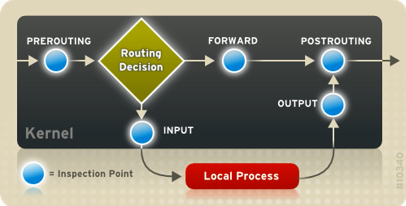
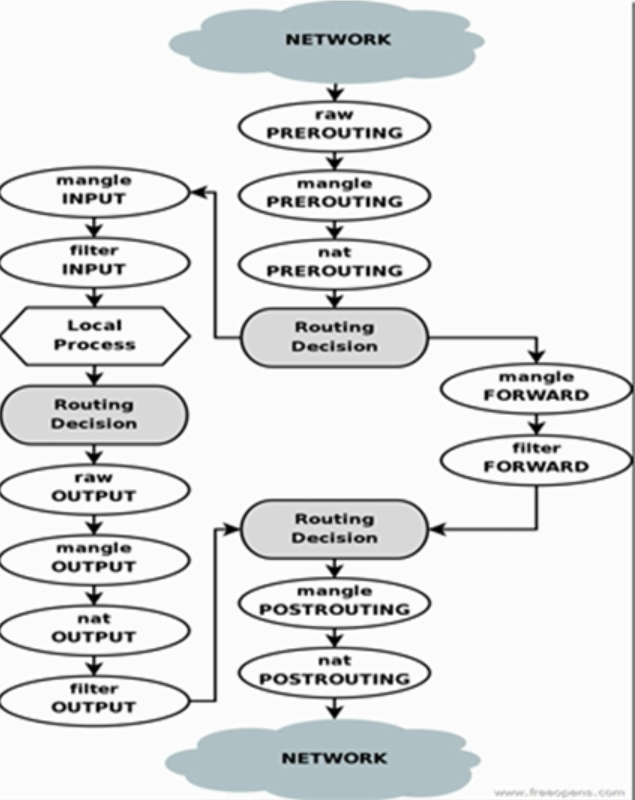
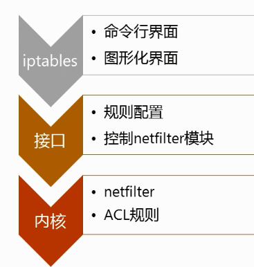
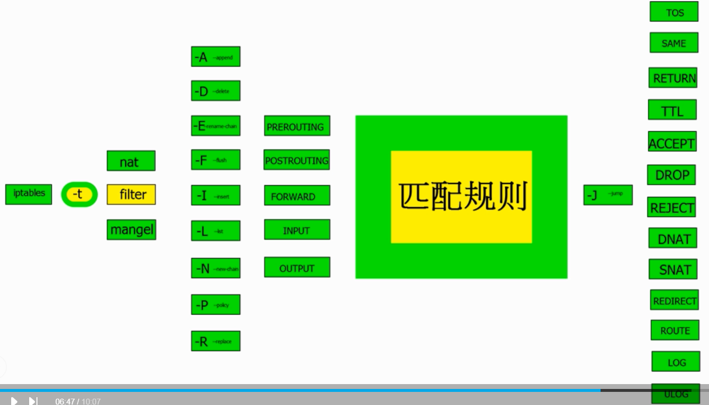

## 什么是防火墙 && 工作机制

网络过滤器： 放行 和 阻止(扔包)  或 处理后放行
在网络边界作为一个网络海关的角色

1. 获取 : 嗅探、正常请求 。。。
2. 识别分类： 协议头、具体内容 。。。
3. 过滤 ： 丢弃、修改、放行、记录日志 。。。

## netfilter 数据流通道 和 网络控制点

**乱七八糟**

如果你只在本机开启的防火墙 不需要转发 只有两个控制点 【input/output】
如果是网络防火墙 全部节点都用到

NAT（net 网关）用到了3个控制点 ： prerouting postrouting output
filter（防火墙） : input output { forward  网络防火墙用}
mangle(net网关和防火墙)：全部用到

prerouting  路由之前的检查
routing decision 路由决策 有路由表 : 直接传给本地程序还是传给
forward 内容检查
postrouting  发送路由的检查 (如果不要 这里就扔掉)
local process 本地进程
 

## netfilter 可以实现的功能

NAT 转发
防火墙
传输层代理

## iptables语法

有几个控制点：
nat
filter 保护本机 
mangel 

下面是动作 + 控制点 input output 等
-A append
-d delete

匹配规则后 控制规则

-J accept 通过 等
 

