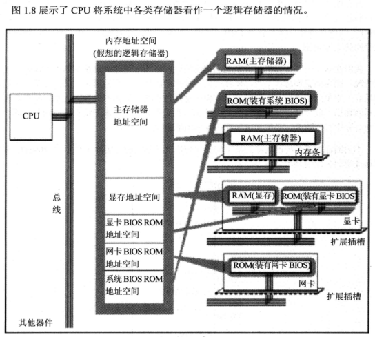

## 汇编语言的组成

	1、汇编指令 ( 【核心】 机器码的助记符 有一一对应的机器码)
	2、伪指令 （编译器执行 计算机并不执行）
	3、其他符号 (编译器识别 如 + - * /) 

## 存储单元
	CPU可以直接使用的信息都在存储器中存放
	存储器被划分为若干个存储单元 每个单元从0开始排序编号

## 指令和数据

	指令和数据存储在内存中或磁盘上时 都是二进制信息
	你可以把它当做数据 也可以当做程序

## CPU对存储器的读写

**CPU和其他器件的配合工作**

	cpu要进行数据读写必须和外部器件进行三类信息交互：
	
	1、 存储单元的地址(地址信息)
	2、 器件的选择, 读/写命令(控制信息)
 	3、 读/写的数据(数据信息)

	步骤为: 先发送地址信息、后发送控制信息 最后发送/接收(写/读)数据 

> 地址总线

连接CPU和其他器件的导线 称之为总线

物理上 : 一根根导线的集合

逻辑上：

- 地址总线
- 数据总线
- 控制总线
	
### 地址总线
*cpu通过地址总线来指定存储单元*

> 地址总线的宽度

CPU有多少根地址总线

> 寻址能力

地址总线的宽度 决定了CPU的寻址能力

如: *N根地址总线 cpu的寻址能力为 2的N次方*

> 地址的发送方式

 **由低位到高位**  通过地址总线 如:发送 11010000 实际数据为 1011 前面补了0

### 数据总线

cpu和其他器件之间的数据传送 通过数据总线进行 （可以传送多次）

数据总线的宽度决定了 数据传送的速度(每次传送的量)

数据发送 也是由低位到高位

### 控制总线(不通控制线的集合)

CPU对外部器件的控制通过控制总线来进行

控制总线的宽度决定了CPU对外部器件的可控制能力(对器件有多少种控制类型)

读/写 命令是由几根控制线综合发出的。 有一根为写 一根为读的控制线分别传送读/写的信号

	检测点 1.1

    1个CPU的寻址能力为8KB，那么它的地址总线的宽度为____。
    13
    解析：CPU在内存中寻址的最小单位是Byte（字节），8KB = 2^13B，因此地址总线的宽度为13.
    1KB的存储器有____个存储单元。存储单元的编号从____到____。
    1024 0 1023
    1KB的存储器可以存储____个bit，____个Byte。
    2^13 2^10
    1GB、1MB、1KB分别是____________Byte
    2^30 2^20 2^10
    8080、8088、80286、80386的地址总线宽度分别为16根、20根、24根、32根，则他们的寻址能力分别为____（KB）、____（MB）、____（MB）、____（GB）。
    64 1 16 4
    8080、8088、8086、80286、80386的数据总线宽度分别为8根、8根、16根、16根、32根。则它们一次可以传送的数据为：____（B）、____（B）、____（B）、____（B）、____（B）。
    1 1 2 2 4
    从内存中读取1024字节的数据，8086至少要读取____次，80386至少要读取____次。
    512 256
    在存储器中，数据和程序以____形式存放。
    二进制

## 内存地址空间

通过地址总线可寻到的内存单元构成这个CPU的内存地址空间

> 主板 接口卡 各类存储器芯片

- 所有可用程序控制其工作的设备 必须受到CPU的控制。
- CPU对外部设备不能直接控制。直接可控制这些设备工作的是扩展插槽上的接口卡 扩展插槽/接口卡通过总线与CPU相连  CPU直接控制这些接口卡对外设实现间接控制
- 核心设备 外围芯片组 扩展插槽等都是集成在主板上的

- 存储器芯片从物理上看是独立的 、 都和总线项链、通过控制线发出读写命令进行读写

> 内存地址空间

CPU在操控它们(各类存储器芯片)的时候把他们当做内存对待 **把它们总的看做一个由若干存储单元组成的逻辑存储器**  这个逻辑存储器就是内存地址空间(大小受CPU寻址能力的限制)
*也就是吧所有存储单元看成一个整体*

**不同的计算机系统内存空间分配也不一样**

8086pc机的内存地址空间分配

- 00000 - 9FFFF 主存储区地址空间
- A0000 - BFFFF 显卡地址空间
- C0000 - FFFFF 各类ROM地址空间

**最初运行程序的是CPU  用任何语言编程时都要从CPU的角度考虑问题**
